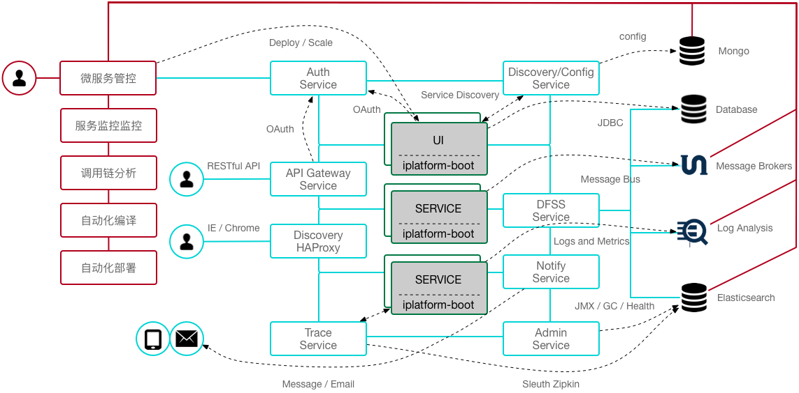

# REIPLATFORM-BOOT

>  作者 张磊 2018-9-30

IPLATFORM-BOOT 是以 SpringCloud 为核心的微服务开发框架，提供了基础的公共服务。

手册中相关技术使用可以参考 [样例代码](https://github.com/coolbeevip/iplatform-boot-example)

## 1. 公共服务部署手册

* [注册服务部署手册](iplatform-common/DiscoveryService.md)
* [认证服务部署手册](iplatform-common/AuthService.md)
* [文档服务部署手册](iplatform-common/DfssService.md)
* [跟踪服务部署手册](iplatform-common/TraceService.md)
* [监控服务部署手册](iplatform-common/AdminService.md)
* [通知服务部署手册](iplatform-common/NotifyService.md)
* [访问代理服务部署手册](iplatform-common/DiscoveryHAProxy.md)
* [分布式事务中间件手册](iplatform-common/ServiceCombAlpha.md)

## 2. 开发手册

* [项目构建手册](YourFirstProject.md)
* [应用打包部署手册](ProjectBuild.md)
* 编码规约

  * [定时任务规约](developer/coding/Schedule.md)
  * [文件上传规约](developer/coding/FileUpload.md)
  * [异步处理规约](developer/coding/Async.md)
  * [RESTfulAPI规约](developer/coding/RESTfulAPI.md)
  * [缓存使用规约](developer/coding/Cache.md)
  * [自定义参数规约](developer/coding/CustomProperties.md)
  * [鉴权规约](developer/coding/Authority.md)
  * [Shutdown规约](developer/coding/Shutdown.md)
  * [获取配置参数](developer/coding/Environment.md)
  * [发号器规约](developer/coding/UUID.md)
  * [可配置模块加载](developer/coding/CustomService.md)
* 开发手册
  * [Service开发手册](developer/service/README.md)
  * [Controller开发手册](developer/controller/README.md)
  * [服务调用开发手册](developer/fegin/README.md)
  * [数据库开发手册](developer/database/README.md)
  * [数据库版本管理](developer/flyway/README.md)
  * [ActiveMQ开发手册](developer/activemq/README.md)
  * [Flume开发手册](developer/flume/README.md)
  * [Kafka开发手册](developer/kafka/README.md)
  * [ElasticSearch开发手册](developer/elasticsearch/README.md)
  * [Redis开发手册](developer/redis/README.md)
  * [Mongo开发手册](developer/mongo/README.md)
  * [Tomcat开发手册](developer/tomcat/README.md)
* 分布式相关开发手册

  * [文档服务集成手册](/developer/dfss/README.md)
  * [集中日志开发手册](/developer/logger/README.md)
  * [集中配置开发手册](/developer/config/README.md)
  * [分布式锁开发手册](developer/distributedlock/README.md)
  * [集中式缓存开发手册](developer/centralizedcache/README.md)
  * [分布式缓存开发手册](developer/distributedcache/README.md)
  * [服务跟踪配置手册](developer/trace/README.md)
  * [负载均衡配置手册](developer/loadbalance/README.md)
  * [消息总线集成手册](developer/messagebus/README.md)
  * [多租户配置手册](developer/multitenant/README.md)
  * [通知服务集成手册](developer/notify/README.md)
  * [断路器集成手册](developer/hystrix/README.md)
  * [分布式事务集成手册](developer/distributedtransactions/README.md)
* 其他

  * [日志标准化](Logs.md)
  * [安全开发手册](Security.md)
  * [Docker](Dockerfile.md)
  * [关于超时配置](Timeout.md)
  * 自动化测试

## 3. 中间件部署手册

- [ActiveMQ](middleware/ActiveMQ.md)
- [Kafka](middleware/Kafka.md)
- [ELK](middleware/ELK.md)
- [Storm](middleware/Storm.md)
- [MySQL](middleware/MySQL.md)
- [Redis](middleware/Redis.md)
- [Nginx](middleware/Nginx.md)
- [Mongo](middleware/Mongo.md)

## 4. 微服务管控

- [微服务管控平台部署手册](product/triden/README.md)
- [微服务管控平台集成](product/triden/API.md)
- [自动化引擎集成手册](product/automatic/README.md)

## 5. 其他

* [风格指南](StyleGuide.md)
* [框架参数说明](Properties.md)
* [基准测试](Benchmark.md)
* [IPv6 Support](IPv6.md)
* [版本跟踪](ChangeLog.md)
* [Spring Boot 1.3.5 Reference Guid](https://docs.spring.io/spring-boot/docs/1.3.5.RELEASE/reference/html/)

## 6.贡献者

详情可浏览[提交指南](contributing/README.md)

文档：[coderwls](https://github.com/coderwls) [duzhen](https://github.com/duzhen020623) [Yu Shengqiang](https://github.com/ShefronYudy) [yubowinner](https://github.com/yubowinner) [liuxinan](https://github.com/liuxinan)