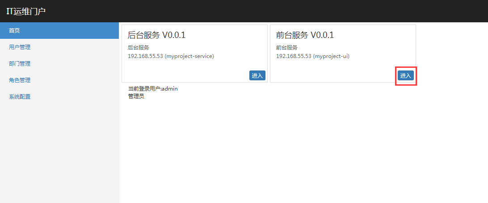

# 项目构建手册

> 作者 王立松

通过本文档可以快速开发一个属于你的SERVICE、UI服务，你可以看到服务是如何注册到注册中心，并通过认证服务登录后完成一个UI到SERVICE调用的样例

## 1. 前提

- [已安装发现服务](iplatform-common/DiscoveryService.md)
- [已安装认证服务](iplatform-common/AuthService.md)
- JDK1.8+
- MAVEN3.5+

## 2. 项目构建

- 项目信息

  ```properties
  groupId=org.iplatform.myproject
  artifactId=myproject
  package=org.iplatform.myproject
  version=0.0.1-SNAPSHOT
  ```

- 创建项目

  ```properties
  mvn org.apache.maven.plugins:maven-archetype-plugin:2.4:generate \
  -DgroupId=org.iplatform.myproject \
  -DartifactId=myproject \
  -Dpackage=org.iplatform.myproject \
  -Dversion=0.0.1-SNAPSHOT \
  -DarchetypeCatalog=http://127.0.0.1/nexus/content/repositories/releases \
  -DarchetypeRepository=http://127.0.0.1/nexus/content/repositories/releases \
  -DarchetypeGroupId=org.iplatform.archetypes \
  -DarchetypeArtifactId=iplatform-all-archetype \
  -DarchetypeVersion=0.0.8 \
  -DinteractiveMode=false
  ```

- 目录结构说明

  | 目录结构                      | 说明                     |
  | :---------------------------- | :----------------------- |
  | myproject/config/local/run.sh | 启停脚本                 |
  | myproject/service             | SERVICE服务              |
  | myproject/ui                  | UI服务                   |
  | myproject/util                | UI和SEERVICE公用的工具包 |

## 3. 文件修改

### UTIL

> 修改myproject/util/pom.xml，自定义项目名称myproject-util

```xml
<modelVersion>4.0.0</modelVersion>
<groupId>org.iplatform.myproject</groupId>
<artifactId>myproject-util</artifactId>
<version>0.0.1-SNAPSHOT</version>
<parent>
    <groupId>org.iplatform.myproject</groupId>
    <artifactId>myproject</artifactId>
    <version>0.0.1-SNAPSHOT</version>
    <relativePath>../</relativePath>
</parent>
```

### SERVICE

> 修改myproject/service/pom.xml，自定义项目名称myproject-service，调整引用myproject-util

```xml
<modelVersion>4.0.0</modelVersion>
<groupId>org.iplatform.myproject</groupId>
<artifactId>myproject-service</artifactId>
<version>0.0.1-SNAPSHOT</version>
<name>myproject-service</name>
<description>myproject-service</description>
<packaging>jar</packaging>
<dependencies>
    <dependency>
        <groupId>org.iplatform.myproject</groupId>
        <artifactId>myproject-util</artifactId>
        <version>0.0.1-SNAPSHOT</version>
    </dependency>
</dependencies>
```

### UI

> 修改myproject/ui/pom.xml，自定义项目名称myproject-ui，调整引用myproject-util

```xml
<modelVersion>4.0.0</modelVersion>
<groupId>org.iplatform.myproject</groupId>
<artifactId>myproject-ui</artifactId>
<version>0.0.1-SNAPSHOT</version>
<name>myproject-ui</name>
<description>myproject-ui</description>
<packaging>jar</packaging>
<parent>
    <groupId>org.iplatform.myproject</groupId>
    <artifactId>myproject</artifactId>
    <version>0.0.1-SNAPSHOT</version>
    <relativePath>../</relativePath>
</parent>
<dependencies>
    <dependency>
        <groupId>org.iplatform.myproject</groupId>
        <artifactId>myproject-util</artifactId>
        <version>0.0.1-SNAPSHOT</version>
    </dependency>
</dependencies>
```

### RUN.SH

> 修改项目名称、服务发现地址、服务IP、服务端口、contextPath等，其中contextPath必须配置，不可省略，7层负载均衡的实现依赖此参数

```properties
PRONAMEUI=myproject-ui-0.0.1-SNAPSHOT.jar
PRONAMESERVICE=myproject-service-0.0.1-SNAPSHOT.jar

nohup java -Xmx1g -Xms1g -Xss256k -XX:OnOutOfMemoryError="kill -9 %p" -jar ${PRONAMESERVICE} \
    --discovery.server.address="https://127.0.0.1:8761/eureka/" \
    --server.host=127.0.0.1 \
    --contextPath=myprojectservice \
    --spring.profiles.active=prod >/dev/null 2>&1 &

    nohup java -Xmx1g -Xms1g -Xss256k -XX:OnOutOfMemoryError="kill -9 %p" -jar ${PRONAMEUI} \
    --discovery.server.address="https://127.0.0.1:8761/eureka/" \
    --server.host=127.0.0.1 \
    --contextPath=myprojectui \
    --spring.profiles.active=prod >/dev/null 2>&1 &
```

## 4. 打包

> myproject目录下执行打包命令

```shell
mvn clean package
```

## 5. 部署

1. 创建部署目录
2. 复制myproject/service/target/myproject-service-0.0.1-SNAPSHOT.jar到部署目录下
3. 复制myproject/ui/target/myproject-ui-0.0.1-SNAPSHOT.jar到部署目录下
4. 复制run.sh到部署目录下

## 6. 启停

1. 启动服务

   ```shell
   sh run.sh start
   
   出现如下日志，代表启动成功
   eureka.instance.metadataMap.instanceId=Document::myproject-service:8081
   o.i.m.core.IPlatformApplication.run : 服务启动完毕
   ```

2. 停止服务

   ```shell
   sh run.sh stop
   ```

3. 重启服务

   ```shell
   sh run.sh restart
   ```

## 2. 验证

1. 验证服务注册

   > 访问注册中心 http://127.0.0.1:8761 ，查看已注册的服务列表

   

2. 验证服务认证

   > 访问认证系统 https://127.0.0.1:9999/auth ，通过默认用户名密码登录，认证列表查找UI服务并进入

   

   

3. 验证SERVICE服务接口

   > curl请求返回json串

   ```shell
   [root@localhost opt]# curl -k "https://192.168.55.53:8081/myprojectservice/api/v1/hello?access_token=xx"
   {"success":true,"message":null,"data":"Hi"}[root@localhost opt]# 
   ```

4. 验证UI到SERVICE服务调用

   > curl请求返回字符串 Hi

   ```shell
   [root@localhost opt]# curl -k "https://192.168.55.53:8080/myprojectui/hello?access_token=xx"
   Hi[root@localhost opt]# 
   ```

## 5. 骨架代码说明

### SERVICE说明

| 文件地址                                                  | 文件说明                             |
| :-------------------------------------------------------- | :----------------------------------- |
| org.iplatform.myproject.service.ServiceApplication.java   | 主启动类                             |
| org.iplatform.myproject.service.service.IndexService.java | 接口类，提供对外接口                 |
| src/main/resources/bootstrap.yml                          | 应用定义，包括应用名称、描述、版本等 |
| src/main/resources/application.yml                        | 应用配置，包含IP地址、端口、数据源等 |

### UI说明

| 文件地址                                                     | 文件说明                                      |
| :----------------------------------------------------------- | :-------------------------------------------- |
| org.iplatform.myproject.ui.UIApplication.java                | 主启动类                                      |
| org.iplatform.myproject.ui.config.MyprojectUISecurityConfiguration | 拦截器，自定义跳过认证拦截的路径              |
| org.iplatform.myproject.ui/feign.IndexClient.java            | Feign客户端，通过Feign实现对SERVICE接口的调用 |
| org.iplatform.myproject.ui.controller.IndexController        | 控制器                                        |
| src/main/resources/bootstrap.yml                             | 应用定义，包括应用名称、描述、版本等          |
| src/main/resources/application.yml                           | 应用配置，包含IP地址、端口、数据源等          |
| src/main/resources/templates/index.html                      | 主页面，登录成功后跳转至主页面                |
