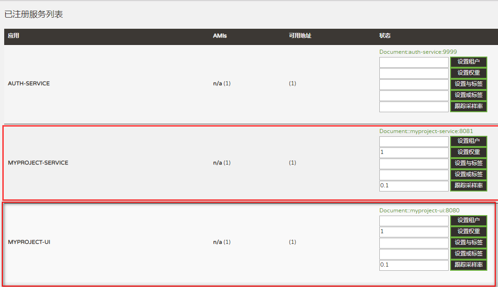

# 项目构建手册

> 作者 王立松

通过本文档可以快速部署一个认证服务、注册服务，并开发一个你的SERVICE、UI服务，你可以看到服务是如何注册到注册中心，并通过认证服务登录后完成一个UI到SERVICE调用的样例

## 1. 准备

* 已安装发现服务
* 已安装认证服务
* 开发环境 JDK1.8+
* 开发工具 Spring Tool Suite

## 2. 项目创建

### SERVICE创建

1. 打开Spring Tool Suite，创建Spring Starter Project


   

   

   
2. demo-service/pom.xml调整，调整后内容如下

```xml
<?xml version="1.0" encoding="UTF-8"?>
<project xmlns="http://maven.apache.org/POM/4.0.0" xmlns:xsi="http://www.w3.org/2001/XMLSchema-instance"
	xsi:schemaLocation="http://maven.apache.org/POM/4.0.0 http://maven.apache.org/xsd/maven-4.0.0.xsd">
	<modelVersion>4.0.0</modelVersion>

	<groupId>org.iplatform</groupId>
	<artifactId>demo-service</artifactId>
	<version>0.0.1-SNAPSHOT</version>
	<packaging>jar</packaging>

	<name>demo-service</name>
	<description>demo-service</description>
	
	<parent>
		<groupId>org.iplatform</groupId>
		<artifactId>iplatform-parent</artifactId>
		<version>0.0.7-SNAPSHOT</version>
		<relativePath></relativePath>
	</parent>
	
	<dependencies>
		<dependency>
			<groupId>org.iplatform</groupId>
			<artifactId>iplatform-util</artifactId>
			<exclusions>
				<exclusion>
					<artifactId>slf4j-log4j12</artifactId>
					<groupId>org.slf4j</groupId>
				</exclusion>
			</exclusions>
		</dependency>
        <dependency>
            <groupId>org.iplatform</groupId>
            <artifactId>iplatform-service</artifactId>
        </dependency>       
	</dependencies>

	<build>
		<plugins>
			<plugin>
				<groupId>org.springframework.boot</groupId>
				<artifactId>spring-boot-maven-plugin</artifactId>
			</plugin>
			<plugin>
				<groupId>org.apache.maven.plugins</groupId>
				<artifactId>maven-surefire-plugin</artifactId>
				<configuration>
					<skipTests>true</skipTests>
				</configuration>
			</plugin>
		</plugins>
	</build>

	<repositories>
		<repository>
			<id>boco-nexus-public</id>
			<name>Team Nexus Repository</name>
			<url>http://111.204.35.232/nexus/content/groups/public</url>
		</repository>
	</repositories>

</project>
```
3. demo-service/src/main/resources/application.properties调整为application.yml，配置内容如下

```
discovery.server.address: https://localhost:8761/eureka/
server:
  port: 50090
  host: localhost
  contextPath: /demoservice
```
| 参数名                       | 说明                                                         |
| --------------------------- | ------------------------------------------------------------ |
| discovery.server.address    | 定义注册服务的地址，当集群模式时配置多个地址逗号分隔              |
| server.host                 | 服务绑定IP                                                    |
| server.port                 | 服务绑定端口                                                  |

4. demo-service/src/main/resources下新增bootstrap.yml，配置内容如下

```
info:
  app:
    name: demo服务层
    description: demo服务层
    version: 0.0.1
spring:
  application:
    name: demo-service
```

5. 测试类DemoServiceApplicationTests调整，调整后内容如下

```java
package org.iplatform.microservices.demoservice;

import org.junit.Test;
import org.junit.runner.RunWith;
import org.springframework.boot.test.context.SpringBootTest;
import org.springframework.test.context.junit4.SpringJUnit4ClassRunner;

@RunWith(SpringJUnit4ClassRunner.class)
@SpringBootTest
public class DemoServiceApplicationTests {

	@Test
	public void contextLoads() {
	}

}
```

6. 主启动类DemoServiceApplication调整，调整后内容如下

```java
package org.iplatform.microservices.demoservice;

import org.iplatform.microservices.service.IPlatformServiceApplication;
import org.springframework.boot.autoconfigure.SpringBootApplication;
import org.springframework.cache.annotation.EnableCaching;
import org.springframework.cloud.client.discovery.EnableDiscoveryClient;
import org.springframework.cloud.netflix.eureka.EnableEurekaClient;
import org.springframework.context.annotation.ComponentScan;
import org.springframework.context.annotation.EnableAspectJAutoProxy;
import org.springframework.jms.annotation.EnableJms;
import org.springframework.security.oauth2.config.annotation.web.configuration.EnableOAuth2Client;
import org.springframework.security.oauth2.config.annotation.web.configuration.EnableResourceServer;
import org.springframework.transaction.annotation.EnableTransactionManagement;

@EnableOAuth2Client
@SpringBootApplication
@EnableTransactionManagement
@EnableDiscoveryClient
@EnableEurekaClient
@EnableResourceServer
@EnableJms
@EnableCaching
@EnableAspectJAutoProxy
@ComponentScan(basePackages = {"org.iplatform.microservices"})
public class DemoServiceApplication extends IPlatformServiceApplication {

	public static void main(String[] args) throws Exception {
		run(DemoServiceApplication.class, args);
	}
}
```

7. 新增TestService类，提供对外接口

```java
package org.iplatform.microservices.demoservice.service;

import org.iplatform.microservices.core.http.RestResponse;
import org.springframework.http.HttpStatus;
import org.springframework.http.ResponseEntity;
import org.springframework.stereotype.Service;
import org.springframework.web.bind.annotation.RequestMapping;
import org.springframework.web.bind.annotation.RequestMethod;
import org.springframework.web.bind.annotation.RequestParam;
import org.springframework.web.bind.annotation.RestController;

@Service
@RestController
@RequestMapping("/api/v1/test")
public class TestService {

	@RequestMapping(value = "/hello", method = RequestMethod.GET)
	public ResponseEntity<RestResponse<String>> hello(@RequestParam(value="param") String param){
		RestResponse<String> response = new RestResponse<String>();
		response.setData("hello "+param+", I am TestService");
	    response.setSuccess(Boolean.TRUE);
	    return new ResponseEntity<>(response, HttpStatus.OK);
	}
	
}
```

### UI创建

1. 创建UI项目与SERVICE项目一致，只是名称和包名不同，service相关的内容需替换为ui

2. demo-ui/pom.xml调整，调整后内容如下

```xml
<?xml version="1.0" encoding="UTF-8"?>
<project xmlns="http://maven.apache.org/POM/4.0.0" xmlns:xsi="http://www.w3.org/2001/XMLSchema-instance"
	xsi:schemaLocation="http://maven.apache.org/POM/4.0.0 http://maven.apache.org/xsd/maven-4.0.0.xsd">
	<modelVersion>4.0.0</modelVersion>

	<groupId>org.iplatform</groupId>
	<artifactId>demo-ui</artifactId>
	<version>0.0.1-SNAPSHOT</version>
	<packaging>jar</packaging>

	<name>demo-ui</name>
	<description>demo-ui</description>

	<parent>
		<groupId>org.iplatform</groupId>
		<artifactId>iplatform-parent</artifactId>
		<version>0.0.7-SNAPSHOT</version>
		<relativePath></relativePath>
	</parent>
	
	<dependencies>
		<dependency>
			<groupId>org.iplatform</groupId>
			<artifactId>iplatform-util</artifactId>
			<exclusions>
				<exclusion>
					<artifactId>slf4j-log4j12</artifactId>
					<groupId>org.slf4j</groupId>
				</exclusion>
			</exclusions>
		</dependency>
        <dependency>
            <groupId>org.iplatform</groupId>
            <artifactId>iplatform-ui</artifactId>
        </dependency>       
	</dependencies>

	<build>
		<plugins>
			<plugin>
				<groupId>org.springframework.boot</groupId>
				<artifactId>spring-boot-maven-plugin</artifactId>
			</plugin>
			<plugin>
				<groupId>org.apache.maven.plugins</groupId>
				<artifactId>maven-surefire-plugin</artifactId>
				<configuration>
					<skipTests>true</skipTests>
				</configuration>
			</plugin>
		</plugins>
	</build>

	<repositories>
		<repository>
			<id>boco-nexus-public</id>
			<name>Team Nexus Repository</name>
			<url>http://111.204.35.232/nexus/content/groups/public</url>
		</repository>
	</repositories>

</project>
```
3. demo-ui/src/main/resources/application.properties调整为application.yml，配置内容如下
  
```
discovery.server.address: https://localhost:8761/eureka/
server:
  port: 50091
  host: localhost
  contextPath: /demoui
```

4. demo-ui/src/main/resources下新增bootstrap.yml，配置内容如下

```
info:
  app:
    name: demoUI层
    description: demoUI层
    version: 0.0.1
spring:
  application:
    name: demo-ui
```

5. 删除测试类DemoUiApplicationTests

6. 主启动类DemoUiApplication调整，调整后内容如下

```java
package org.iplatform.microservices.demoui;

import org.iplatform.microservices.ui.IPlatformUIApplication;
import org.springframework.boot.autoconfigure.SpringBootApplication;
import org.springframework.cache.annotation.EnableCaching;
import org.springframework.cloud.client.discovery.EnableDiscoveryClient;
import org.springframework.cloud.netflix.eureka.EnableEurekaClient;
import org.springframework.cloud.netflix.feign.EnableFeignClients;
import org.springframework.cloud.netflix.hystrix.EnableHystrix;
import org.springframework.context.annotation.ComponentScan;
import org.springframework.context.annotation.Configuration;
import org.springframework.context.annotation.EnableAspectJAutoProxy;
import org.springframework.jms.annotation.EnableJms;
import org.springframework.security.oauth2.config.annotation.web.configuration.EnableOAuth2Client;
import org.springframework.security.oauth2.config.annotation.web.configuration.EnableResourceServer;
import org.springframework.web.bind.annotation.RestController;

@Configuration
@SpringBootApplication
@EnableDiscoveryClient
@EnableEurekaClient
@EnableResourceServer
@EnableFeignClients
@RestController
@EnableHystrix
@EnableOAuth2Client
@EnableCaching
@EnableJms
@EnableAspectJAutoProxy
@ComponentScan(basePackages = {"org.iplatform.microservices"})
public class DemoUiApplication extends IPlatformUIApplication{

	public static void main(String[] args) throws Exception {
		run(DemoUiApplication.class, args);
	}
}

```

7. 新增IndexController和对应的demo-ui/src/main/resources/templates/index.html

```java
package org.iplatform.microservices.demoservice.service;

import org.iplatform.microservices.core.http.RestResponse;
import org.springframework.http.HttpStatus;
import org.springframework.http.ResponseEntity;
import org.springframework.stereotype.Service;
import org.springframework.web.bind.annotation.RequestMapping;
import org.springframework.web.bind.annotation.RequestMethod;
import org.springframework.web.bind.annotation.RequestParam;
import org.springframework.web.bind.annotation.RestController;

@Service
@RestController
@RequestMapping("/api/v1/test")
public class TestService {

	@RequestMapping(value = "/hello", method = RequestMethod.GET)
	public ResponseEntity<RestResponse<String>> hello(@RequestParam(value="param") String param){
		RestResponse<String> response = new RestResponse<String>();
		response.setData("hello "+param+", I am TestService");
	    response.setSuccess(Boolean.TRUE);
	    return new ResponseEntity<>(response, HttpStatus.OK);
	}
	
}
```

```html
<!DOCTYPE html>
<html lang="zh-CN" xmlns:th="http://www.thymeleaf.org" 
	xmlns:layout="http://www.ultraq.net.nz/web/thymeleaf/layout">
<body>
	<div th:text="${returndata}"></div>
</body>
</html>
```
8. 新增TestClient类，提供对service的访问
```java
package org.iplatform.microservices.demoui.feign;

import org.iplatform.microservices.core.http.RestResponse;
import org.springframework.cloud.netflix.feign.FeignClient;
import org.springframework.http.ResponseEntity;
import org.springframework.web.bind.annotation.RequestMapping;
import org.springframework.web.bind.annotation.RequestMethod;
import org.springframework.web.bind.annotation.RequestParam;

@FeignClient("demo-service")
public interface TestClient {
	
	@RequestMapping(value = "demoservice/api/v1/test/hello", method = RequestMethod.GET)
	public ResponseEntity<RestResponse<String>> hello(@RequestParam(value = "param") String param);
	
}
```

## 3. 服务启动
先启动demo-service，然后再启动demo-ui，启动方法：选中项目鼠标右键，选择Run As->Spring Boot App

## 4. 服务验证
1. 访问服务发现链接 https://localhost:8761 在已注册的服务列表中可看到注册的demo-service和demo-ui服务
2. 访问认证服务链接 https://localhost:9999/auth 会跳到登录页面，通过admin/admin登录后可查看demo-service和demo-ui服务
3. 认证页面找到demo-ui服务，点击进入会调用service服务，同时将返回值展示到index.html中
