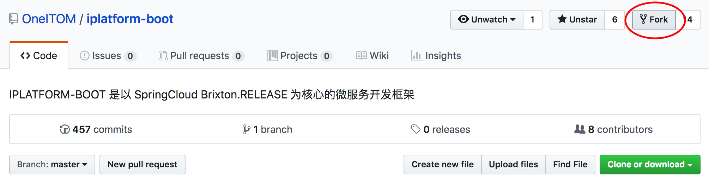
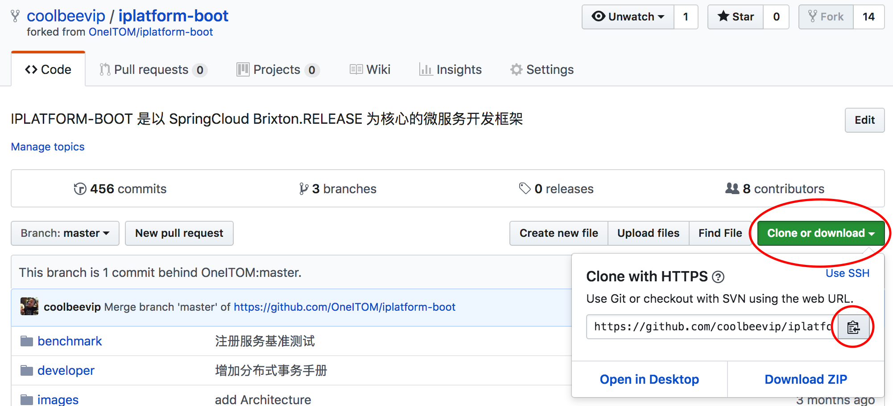

# 贡献指南

### Fork 仓库

进入 [OneITOM/platform-boot](https://github.com/OneITOM/iplatform-boot) 的 [github 页面](https://github.com/apache/servicecomb-website) ，点击右上角按钮 `Fork` 进行 Fork。



### Clone 你 Fork 的仓库到本机

1. 点击 Clone or download 按钮复制地址




2. 将代码克隆到本地

```bash
git clone https://github.com/<your_github_name>/iplatform-boot.git
```

3. 添加 OneITOM/iplatform-boot 远程地址

```bash
cd iplatform-boot
git remote add upstream https://github.com/OneITOM/iplatform-boot.git
```

4. 查看本地关联的远程地址

```bash
git remote -v
origin	https://github.com/<your_github_name>/iplatform-boot.git (fetch)
origin	https://github.com/<your_github_name>/iplatform-boot.git (push)
upstream	https://github.com/OneITOM/iplatform-boot.git (fetch)
upstream	https://github.com/OneITOM/iplatform-boot.git (push)
```

### 修改代码并提交

**注意：**尽量避免直接在master上修改代码，保持一个可持续同步的使用方法应该如下

> 1. 同步 OneITOM/iplatform-boot 的 master 到你本地 master
> 2. 在你本地 master 上创建分支
> 3. 在分支上进行修改
> 4. 提交分支到你的 Github
> 5. 进入你的 Github 页面提交 PR
> 6. 等待你的 PR 被 OneITOM/iplatform-boot 合并
> 7. 同步 OneITOM/iplatform-boot 的 master 到你本地 master
> 8. 推送你本地 master 到你的 Github 的 master 

1. 同步 OneITOM/iplatform-boot 的 master 到你本地 master

    ```bash
    git pull upstream master
    ```

2. 在你本地 master 上创建分支

   > 创建完毕后可以通过 git branch 查看当前是在哪个分支，当前工作分支名前会有一个 `*` 号

    ```bash
    git checkout -b <your_branch_name>
    ```

3. 进行代码修改
4. 提交代码到本地仓库

    ```bash
    git add .
    git commit -a -m "<you_commit_message>"
    ```

5. 推送当前分支到你的 Github

   ```bash
   git push origin <your_branch_name>
   ```

### 创建 PR

在浏览器切换到自己的 Github 页面，你有两个选择

* 如果你看到黄色底色的提示栏，可以直接点击右侧 `Compare & pull request` 按钮
* 也可以把 Branch 切换到你提交的分支，然后点击 `New pull request` 按钮


点击 `Create pull request` 按钮完成提交


至此，你已经完成了一个 PR 的提交，等待合并就可以了，更多 PR 说明参考 [collaborating-with-issues-and-pull-request](https://help.github.com/en/categories/collaborating-with-issues-and-pull-requests)

### 冲突的解决

提交PR时的代码冲突一般是由于多人编辑同一个文件引起的，解决冲突主要通过以下步骤即可

1. 切换主分支

   ```bash
   git checkout master
   ```

2. 同步远端主分支至本地

   ```bash
   git pull upstream master
   ```

3. 切换回刚才的分支

   ```bash
   git checkout <your_branch_name>
   ```

4. 进行rebase

   ```bash
   git rebase -i master
   ```

5. 此时会弹出修改记录的文件，一般直接保存即可。然后会提示哪些文件出现了冲突，此时可打开冲突文件对冲突部分进行修改，将提示的所有冲突文件的冲突都解决后，执行

   ```bash
   git add .
   git rebase --continue
   ```

6. 依此往复，直至屏幕出现类似 *rebase successful* 字样即可，此时您可以进行往提交PR的分支进行更新

   ```bash
   git push -f origin <your_branch_name>
   ```

   