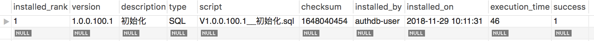
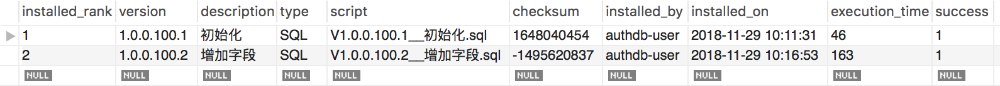

# 数据库版本管理

> 作者 张磊

本框架使用Flyway作为数据库版本管理的组件，实现对于数据库脚本的版本管理，并能够跟随应用一起发布实现数据库版本的自动合并

## 1. 启用版本管理

以下参数都有默认值，在1.0.0框架版本中不需要单独配置开启

```properties
# 开启，默认是true
flyway.enabled=true

# 禁用spring.datasouce的脚本管理，默认是false
spring.datasource.initialize=false
```

## 2. 配置数据源

```properties
# 数据库类型(必填)
spring.datasource.platform=mysql
# JDBC驱动(必填)
spring.datasource.dataSourceClassName=com.mysql.jdbc.Driver
# JDBC URL(必填)
spring.datasource.url='jdbc:mysql://oneitom-mysql:3306/mydb?useUnicode=true&characterEncoding=utf-8&autoReconnect=true'
# 数据库用户名(必填)
spring.datasource.username=mydb-user
# 数据库密码(必填)
spring.datasource.password=ENC(mBaGBXPu1VFgECoBH5NGWeTdFLy79Ic5)
```

## 3. 数据库脚本

> 按照Flyway的命名格式创建脚本文件

### 3.1 命名规则

V{项目版本号}.{库版本号}__{版本描述}.sql

* 项目版本号采用数字点分隔方式，项目自身版本号（同jar）
* 库版本号采用数字点分隔方式
* 版本描述可自定义
* 库版本号和版本描述之间用双下划线分隔

例如：

V1.0.0.100.1__初始化.sql

V1.0.0.100.2__增加XX模块用表

V1.0.0.100.2.1__删除XX字段

V1.0.0.100.3__增加XX字段

### 3.2 文件存放位置

脚本文件存储在项目的 resource/db/{spring.datasource.platform} 目录下

> {spring.datasource.platform} 是框架提供支持的数据库类型，支持h2、mysql、oracle、sqllite、db2、postgresql、informix等

例如：

mysql文件位置

src/main/resources/db/mysql/V1__初始化.sql

oracle文件位置

src/main/resources/db/oracle/V1__初始化.sql

## 4. 举个例子

> 以下步骤的前提是项目初期就采用Flyway进行数据库版本管理，如果是已有项目纳入数据库版本管理，请参考[已有项目迁移到版本管理](#user-content-5)

#### 4.1. V1

> 初始化数据库脚本

定义 V1.0.0.100.1__初始化.sql

```sql
/* 账号表 */
CREATE TABLE DEMO (
  username VARCHAR(200) NOT NULL PRIMARY KEY,
  truename VARCHAR(100) NOT NULL,
  mobile VARCHAR(100)
);
```

系统启动服务后，可以看到如下日志

```shell
Flyway Community Edition 5.2.1 by Boxfuse
Database: jdbc:mysql://127.0.0.1:3306/mydb (MySQL 5.5)
Successfully validated 1 migration (execution time 00:00.026s)
Creating Schema History table: `mydb`.`flyway_schema_myproject-service`
Current version of schema `mydb`: << Empty Schema >>
Migrating schema `authdb` to version 1.0.0.100.1 - 初始化
Successfully applied 1 migration to schema `mydb` (execution time 00:00.152s)
```

可以看到在数据库mydb中创建了版本记录表 "flyway_schema_my-service"，记录表命名格式为flyway_schema_${spring.application.name}

初始化了基线版本 1.0.0.100.1

flyway_schema_my-service表中可以看到如下记录



#### 4.2. V2

> 我们尝试在V1.0.0.100.2中修改表结构

定义 V1.0.0.100.2__增加字段.sql

```sql
/* DEMO表增加 age 字段 */
alter table DEMO add age int;
```

重新启动服务后，可以看到如下日志

```shell
Flyway Community Edition 5.2.1 by Boxfuse
Database: jdbc:mysql://127.0.0.1:3306/mydb (MySQL 5.5)
Successfully validated 2 migrations (execution time 00:00.148s)
Current version of schema `mydb`: 1.0.0.100.1
Migrating schema `mydb` to version 1.0.0.100.2 - 增加字段
Successfully applied 1 migration to schema `mydb` (execution time 00:00.272s)
```

升级到了1.0.0.100.2版本

flyway_schema_my-service表中可以看到如下记录



#### 4.3. V2.1

> 我们尝试增加一些初始化数据

定义 V1.0.0.100.2.1__插入DEMO表初始化数据.sql

```sql
/* 增加初始化数据 */
INSERT INTO DEMO (username,truename,mobile,age) value ('user','user','186xxx',40);
```

重新启动服务后，可以看到如下日志

```shell
Flyway Community Edition 5.2.1 by Boxfuse
Database: jdbc:mysql://127.0.0.1:3306/mydb (MySQL 5.5)
Successfully validated 3 migrations (execution time 00:00.039s)
Current version of schema `mydb`: 1.0.0.100.2
Migrating schema `mydb` to version 1.0.0.100.2.1 - 插入DEMO表初始化数据
Successfully applied 1 migration to schema `mydb` (execution time 00:00.054s)
```

升级到了1.0.0.100.2.1版本

## <a id="5">5</a>. 已有项目迁移到版本管理

> 已有项目因为生产环境已经存在数据库表，所以在迁移时与新建项目纳入版本管理有一些细微区别

例如：假设以上举例的项目已经部署生产环境，并且目前数据库状态处于以上举例项目的V1版本状态，以下演示如何纳入版本管理，并在后续中使用Flyway进行自动升级

#### 5.1. 梳理现有表结构形成初始化版本

> 梳理现有数据库实际schema，形成V1.0.0.100.1版本（命名参数上文的命名规则）

定义 V1.0.0.100.1__初始化.sql

```sql
/* 账号表 */
CREATE TABLE DEMO (
  username VARCHAR(200) NOT NULL PRIMARY KEY,
  truename VARCHAR(100) NOT NULL,
  mobile VARCHAR(100)
);
```

增加启动参数，设置基线版本参数与初始化脚本的版本号一致 1.0.0.100.1

> 这样可以避免这个版本号以及之前的脚本再次被执行

```properties
flyway.baseline-version=1.0.0.100.1
```

启动服务后可看到如下日志

```shell
Flyway Community Edition 5.2.1 by Boxfuse
Database: jdbc:mysql://127.0.0.1:3306/mydb (MySQL 5.5)
Successfully validated 1 migration (execution time 00:00.040s)
Creating Schema History table: `mydb`.`flyway_schema_myproject-service`
Successfully baselined schema with version: 1.0.0.100.1
Current version of schema `mydb`: 1.0.0.100.1
Schema `mydb` is up to date. No migration necessary.
```

可以看到已经初始化了版本表 flyway_schema_auth-service

设置并且当前版本为1.0.0.100.1

flyway_schema_my-service表中可以看到如下记录


可以看到基线版本是从1.0.0.100.1开始的，并且1.0.0.100.1这个脚本没有被执行

#### 5.2. 后续版本管理

后续版本管理与举例中的后续方式是相同的

## 6. 特殊说明

#### 6.1. flyway管理表命名问题

flyway管理表默认命名为flyway_schema_应用名称，由于oracle中表名的最大长度不超过30个字符，很容易超长，针对此种情况可通过如下参数自定义表名

```properties
flyway.table=flyway_schema_xxx
```

#### 6.2. flyway加载顺序问题

由于spring中bean的加载顺序问题，flyway的初始化可能晚于某个具体的bean，当在该bean的构造方法或者是@PostConstruct修饰的方法中对flyway脚本中新增的表或字段进行操作时，会报不存在的错误，针对此种情况可通过注解@DependsOn({"flywayInitializer"})处理，确保该bean的实例化在flyway之后

```java
@Service
@RestController
@RequestMapping("/api/v1")
@DependsOn({"flywayInitializer"})
public class IndexService {
    
    private static final Logger LOG = LoggerFactory.getLogger(IndexService.class);

    @Autowired
    AttachMapper mapper;
    
    @PostConstruct
    public void init() {
        LOG.info("类实例化");
        try {
	    mapper.initData();
	} catch (SQLException e) {
	    e.printStackTrace();
	}
    }
}
```

## 7. 多数据源支持

当使用了多数据源配置后，可以通过设置 `flyway.dynamicdatasource.enabled=true`的方式开启多数据源的数据库版本管理功能，默认情况下所有的多数据源都将支持数据库版本管理

默认多数据源脚本位置 `db/数据源名称/数据源厂家`，例如配置了如下多数据源：

```yaml
spring:
  dynamicdatasource:
    enable: true # 开启支持多数据源
    names: db1,db2
    bomcbp:
      platform: oracle
      dataSourceClassName: oracle.jdbc.driver.OracleDriver
      url: jdbc:oracle:thin:@127.0.0.1:1521:mydb1
      username: user
      password: pwd
    authdb:
      platform: mysql
      dataSourceClassName: com.mysql.jdbc.Driver
      url: "jdbc:mysql://127.0.0.1:3306/mydb2"
      username: user
      password: pwd
```

db1 的脚本存放路径为 `db/db1/oracle`
db2 的脚本存放路径为 `db/db2/mysql`

**注意：**当使用多数据源进行数据库版本管理的时候，多数据源必须配置 `spring.dynamicdatasource.xxx.platform` 参数

* 指定动态数据源进行版本管理
  有的时候不是所有的动态数据源都需要再本服务进行数据库版本管理，那么可以通过参数 `flyway.dynamicdatasource.names` 指定哪个数据源进行版本管理，例如 db1 进行版本管理(多个逗号分隔)：
  ```properites
  flyway.dynamicdatasource.names=db1
  ```
* 动态数据源Flyway个性化参数
  默认情况下动态数据源的 flyway 参数与主数据源的 flyway 参数相同，但是 `locations` 不同。如果想为动态数据源单独定义 flyway 参数可以采用如下方式，例如单独定义 db1 的参数如下：
  ```yaml
  flyway:
    ...
    dynamicdatasource:
      enabled: true
      names: db1
      db1:
        baseline-on-migrate: true
        baseline-description: init
        baseline-version: 0
        locations: db/db1/${spring.datasource.platform}
        clean-on-validation-error: true
        table: flyway_schema_${spring.application.name}
  ```

## 8. 你需要知道的

一旦SQL脚本使用版本管理，那么就不能随意修改已经发布的版本文件，后续修改只能采用版本迭代方式，在使用中需要注意以下几点

* 已经发布的版本文件不可修改，否则会导致无法升级

  例如：V1已经发布并升级到现场，这时在更新版本时对于数据库的修改一定是新建一个V2，不可修改V1，因为框架在启动时会比对当前版本V1的md5和上次已经升级的V1的md5是否一致，只有一致才会升级V2

  **开发过程中对于表结构的反复修改，可以每次修改后删除flyway_schema_xxx表中对应的版本数据后再启动服务即可**

* 数据表的维护只能通过版本管理维护

  如果直接修改数据库结构，而不是通过版本管理，那么可能会造成版本不一致问题，虽然框架不会每次启动比较当前版本和数据库结构是否一致。但是依旧不建议这么做

* 特殊SQL脚本注意维护

  当在已有表中增加一个非空字段时，对于数据的处理需要自行维护，例如

  1. 增加允许为空字段
  2. 初始化这个字段的值
  3. 修改这个字段为非空字段

* 再次执行某一个版本

  由于版本SQL的错误可能会导致不定执行失败，此时可以在版本表中看到对应版本记录的success字段的值为0，此时只要修复SQL中的错误重新执行即可

* 关于事务

  SQL版本中的DML在一个版本文件中会保证在一个事务里，当一个DML语句失败后，本文件中的其他已经执行的DML语句全部回滚，DDL无事务。

* 降级（回退）操作

  不支持降级操作，所以对于drop、delete、truncate这样的清除动作一定要仔细考虑，建议不在乎版本管理中做此操作，而是认为手工维护

* 热修复

  当前已经上线的版本是2，正在开发的版本是3，并且版本3上的数据库表结构已经做了一些改动，此时由于一些BUG需要修复2版本，此时可以增加一个版本2.1，再发布的时候只发布到2.1，这样上线的版本就会执行2.1，当3开发完毕后版本也会按照2->2.1->3的方式进行升级

* 集群并行

  当服务以集群方式部署的时候Flyway通过锁版本表的方式避免多个节点同时进行版本升级
