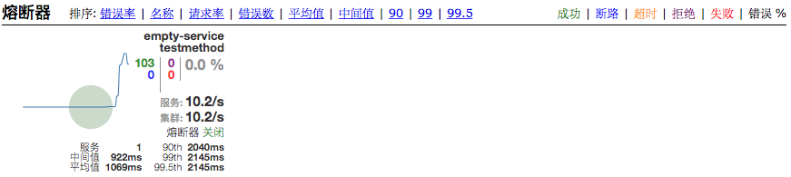

# 断路器集成手册

> 作者 张磊

> 微服务框架已经自动开启了断路器，微服务管控平台会自动获取断路器信息

1. 断路器状态

   使用RESTful API 验证服务断路器是否开启

   ```shell
   curl https://{ip}:{port}/{contextpath}/health
   ```

   看到如下信息表示断路器已经开启

   ```json
   "hystrix": {
   	"status":"UP"
   }
   ```

2. 查看断路器指标

   > 只有通过Fegin调用过的RESTfulAPI才能在断路器指标中看到，如果一直显示ping: 说明目前还没有调用过任何服务，断路器指标采用流推送方式定时推送

   ```shell
   curl https://{ip}:{port}/{contextpath}/hystrix.stream
   ```

   可以看到如下断路器指标数据

   ```json
   data: {
   	"type": "HystrixCommand",
   	"name": "testmethod",
   	"group": "empty-service",
   	"currentTime": 1539318865645,
   	"isCircuitBreakerOpen": false,
   	"errorPercentage": 0,
   	"errorCount": 0,
   	"requestCount": 1,
   	"rollingCountBadRequests": 0,
   	"rollingCountCollapsedRequests": 0,
   	"rollingCountEmit": 0,
   	"rollingCountExceptionsThrown": 0,
   	"rollingCountFailure": 0,
   	"rollingCountFallbackEmit": 0,
   	"rollingCountFallbackFailure": 0,
   	"rollingCountFallbackMissing": 0,
   	"rollingCountFallbackRejection": 0,
   	"rollingCountFallbackSuccess": 0,
   	"rollingCountResponsesFromCache": 0,
   	"rollingCountSemaphoreRejected": 0,
   	"rollingCountShortCircuited": 0,
   	"rollingCountSuccess": 1,
   	"rollingCountThreadPoolRejected": 0,
   	"rollingCountTimeout": 0,
   	"currentConcurrentExecutionCount": 0,
   	"rollingMaxConcurrentExecutionCount": 1,
   	"latencyExecute_mean": 0,
   	"latencyExecute": {
   		"0": 0,
   		"25": 0,
   		"50": 0,
   		"75": 0,
   		"90": 0,
   		"95": 0,
   		"99": 0,
   		"99.5": 0,
   		"100": 0
   	},
   	"latencyTotal_mean": 0,
   	"latencyTotal": {
   		"0": 0,
   		"25": 0,
   		"50": 0,
   		"75": 0,
   		"90": 0,
   		"95": 0,
   		"99": 0,
   		"99.5": 0,
   		"100": 0
   	},
   	"propertyValue_circuitBreakerRequestVolumeThreshold": 20,
   	"propertyValue_circuitBreakerSleepWindowInMilliseconds": 5000,
   	"propertyValue_circuitBreakerErrorThresholdPercentage": 50,
   	"propertyValue_circuitBreakerForceOpen": false,
   	"propertyValue_circuitBreakerForceClosed": false,
   	"propertyValue_circuitBreakerEnabled": true,
   	"propertyValue_executionIsolationStrategy": "SEMAPHORE",
   	"propertyValue_executionIsolationThreadTimeoutInMilliseconds": 180000,
   	"propertyValue_executionTimeoutInMilliseconds": 180000,
   	"propertyValue_executionIsolationThreadInterruptOnTimeout": true,
   	"propertyValue_executionIsolationThreadPoolKeyOverride": null,
   	"propertyValue_executionIsolationSemaphoreMaxConcurrentRequests": 5000,
   	"propertyValue_fallbackIsolationSemaphoreMaxConcurrentRequests": 5000,
   	"propertyValue_metricsRollingStatisticalWindowInMilliseconds": 10000,
   	"propertyValue_requestCacheEnabled": true,
   	"propertyValue_requestLogEnabled": true,
   	"reportingHosts": 1,
   	"threadPool": "empty-service"
   }
   ```

3. 断路器面板

   > [跟踪服务](../../iplatform-common/TraceService.md)自带一个监控个面板

   监控单个服务

   https://oneitom-trace:8763/hystrix/monitor?stream=https://{ip}:{port}/{contextpath}/hystrix.stream

   

   监控所有服务

   https://oneitom-trace:8763/hystrix/monitor?stream=https://oneitom-trace:8763/turbine.stream

