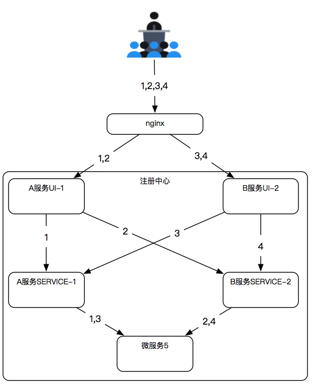
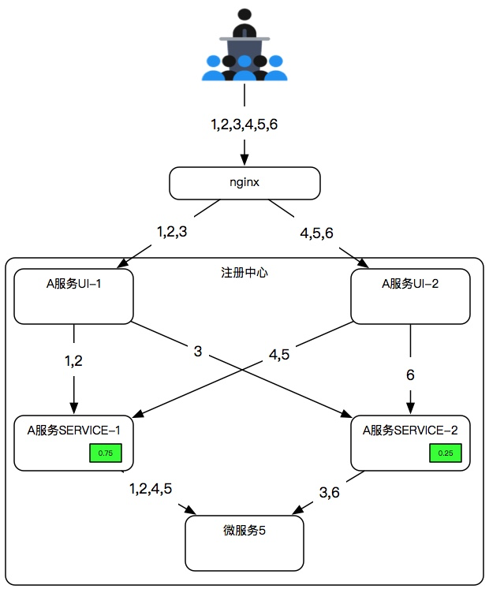
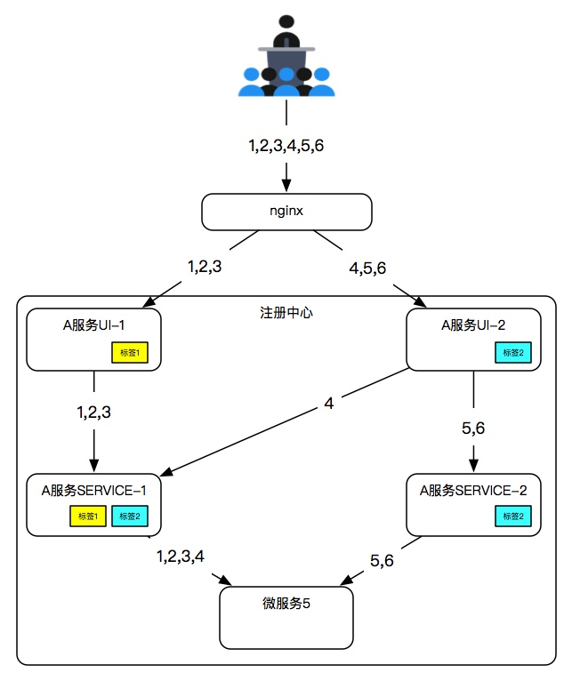

# 负载均衡配置手册

> 作者 张磊

框架基于注册中心提供客户端负载均衡，通过Ribbo+Fegin组件从注册中心获取可用服务列表，然后按照均衡策略进行访问，从而达到负载均衡的作用

## 负载均衡策略

> 框架提供两种负载均衡策略

* 权重

  > 基于权重值的负载均衡策略，权重值大的服务被调用的机率大

* 路由

  > 基于路由标签的服务选择策略，优先选择与自己标签匹配的服务进行调用，路由标签包含与标签和或标签两类，或标签优于与标签

两种策略可以结合使用，路由策略优于权重策略

## 无策略

> 未配置任何策略的时候默认采用轮询方式，可以保证请求被均匀分布到多个服务



## 权重策略

> 当时用权重策略时，权重大的服务被调用的机率大

权重参数配置参数用数字表示，本服务的权重占比=本服务权重/SUM(所有服务权重之和)，例如:

A服务SERVICE-1配置

```properties
eureka.instance.metadataMap.weight=0.75
```

A服务SERVICE-2配置

```properties
eureka.instance.metadataMap.weight=0.25
```



## 路由策略

> 路由策略保证了服务调用时的标签优先选择机制

路由参数值用字符串表示，一个服务允许有多个标签，多个标签用英文逗号隔开。服务在选取被调用服务的时候会优先匹配和自己标签一样的服务

**注意：路由策略只是一种优先选择策略，在匹配不到路由时也会调用同名的服务**

### 标签类型

* labelOr

  > 或标签：调用者的标签只要匹配被调用者或标签中的任何一个标签即可

  例如：或标签是“北京”的服务即可以调用或标签是“北京”的服务，也可以调用或标签是“北京,上海”的服务

* labelAnd

  > 于标签：调用者的标签必须严格匹配被调用者的标签

  例如：与标签是“北京”的服务只能调用与标签是“北京”的服务，不可以调用于标签是“北京,上海”的服务

**在一个服务上如果同时配置与标签和或标签，那么或标签优于与标签（不建议这么使用）**

### 举例：

A服务UI-1

```properties
eureka.instance.metadataMap.labelOr=标签1
```

A服务UI-2

```properties
eureka.instance.metadataMap.labelOr=标签2
```

A服务SERVICE-1

```properties
eureka.instance.metadataMap.labelOr=标签1,标签2
```

A服务SERVICE-2

```properties
eureka.instance.metadataMap.labelOr=标签2
```

* A服务UI-1 每次都会选择相同标签的 A服务SERVICE-1 服务
* A服务UI-2 每次都会选择相同标签的两个服务 A服务SERVICE-1、A服务SERVICE-2 然后按照权重策略调用

**注意：如果 A服务SERVICE-1 服务停止，那么 A服务UI-1 依然会选择 A服务SERVICE-2 进行调用**



