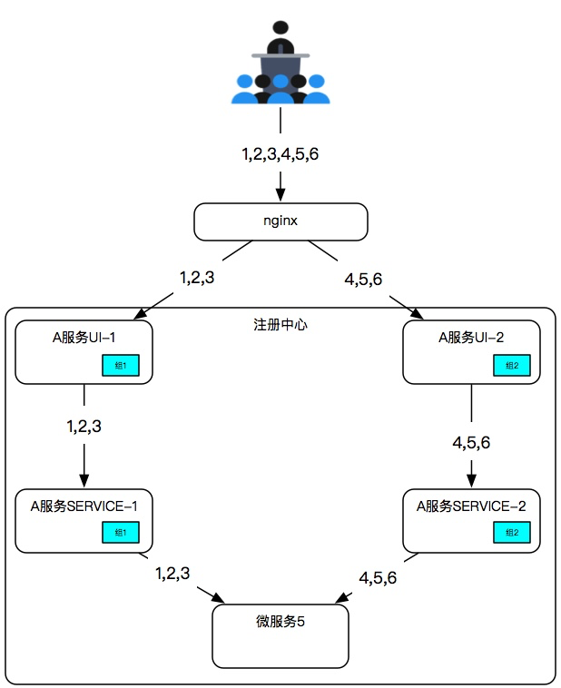
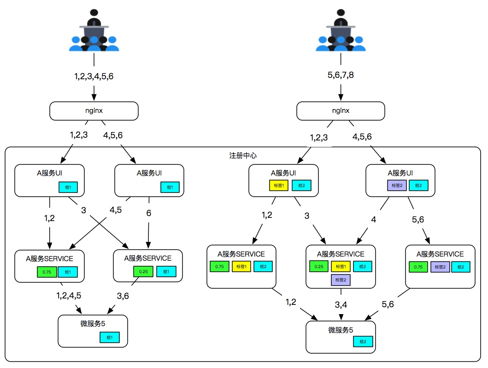

# 多租户配置手册

> 作者 张磊

多租户配置可是实现在一个配置中心注册的服务在进行相互调用时进行租户隔离

## 租户配置参数

一个服务只允许属于一个租户，使用eureka.instance.metadataMap.tenant参数进行配置

```properties
eureka.instance.metadataMap.tenant=租户名称
```

## 举例

> A服务UI-1、A服务SERVICE-1属于同一个租户“组1”，A服务UI-2、A服务SERVICE-2属于同一个租户“组2”，那么A服务UI-1只能调用A服务SERVICE-1，A服务UI-2只能调用A服务SERVICE-2

A服务UI-1

```properties
eureka.instance.metadataMap.tenant=组1
```

A服务UI-2

```properties
eureka.instance.metadataMap.tenant=组2
```

A服务SERVICE-1

```properties
eureka.instance.metadataMap.tenant=组1
```

A服务SERVICE-2

```properties
eureka.instance.metadataMap.tenant=组1
```




## 租户与负载

> 租户可以和负载均衡配置同时使用，服务在进行选择的时候会按照租户、或标签、与标签、权重的优先级顺序进行。

