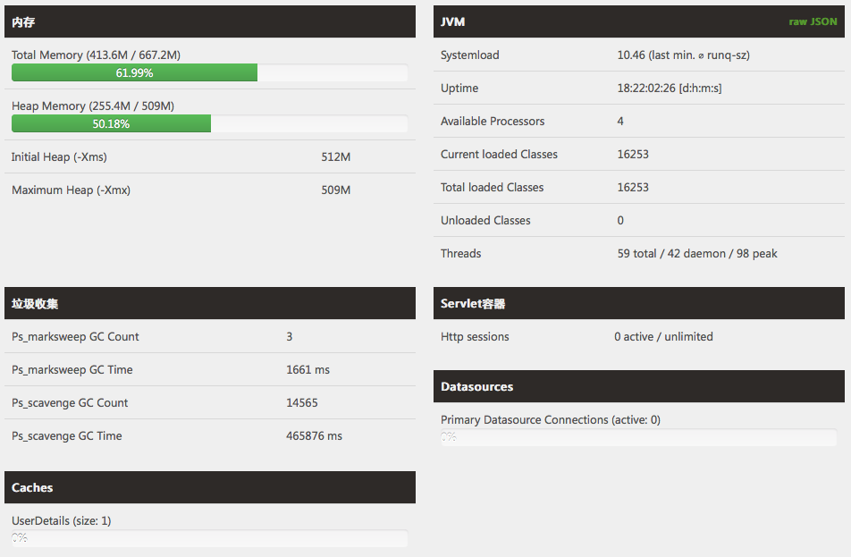
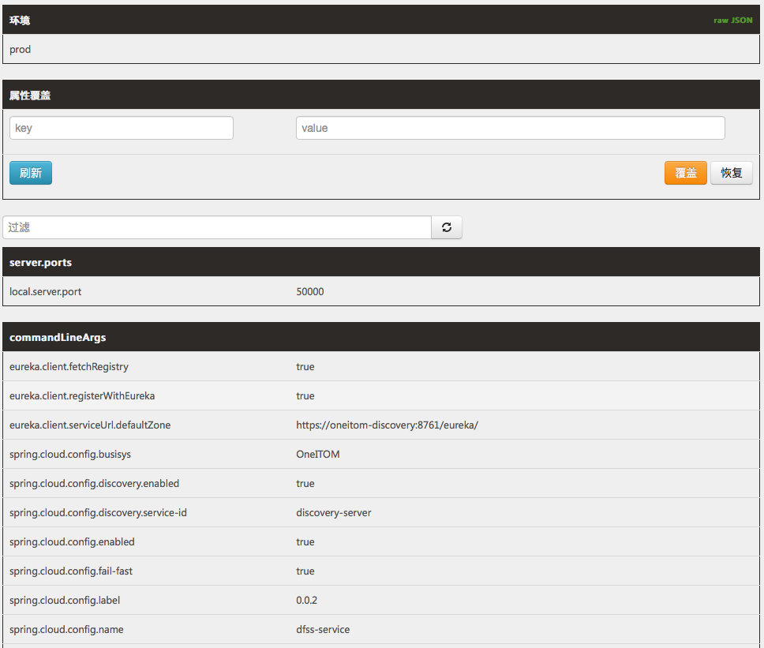
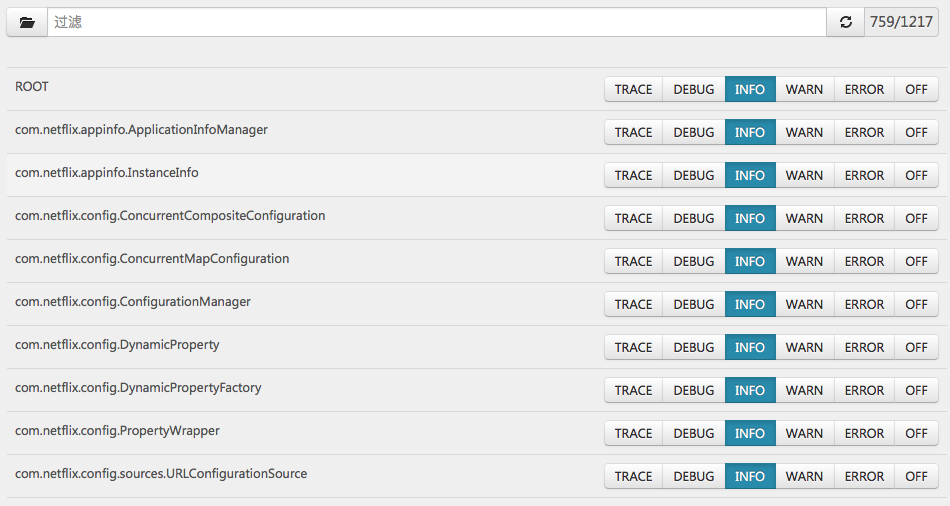

# 监控服务部署手册

> 作者 张磊

## 1. 准备

* JDK1.8+

## 2. 介质

| 文件名                     | 说明       |
| -------------------------- | ---------- |
| admin-server-0.0.2.jar | 主程序文件 |
| run.sh                     | 启停脚本   |

## 3. 启停

启动服务

```bash
sh run.sh start
```

停止服务

```bash
sh run.sh stop
```

 重启服务

```bash
sh run.sh restart
```

##  4. 参数

> 所有的参数都定义在启动脚本 run.sh 中 

| 参数名                      | 必填 | 默认值 | 说明                                                         |
| --------------------------- | ---- | ------ | ------------------------------------------------------------ |
| discovery.server.address    | 是   |        | 定义注册服务的地址，当集群模式时配置多个地址逗号分隔  discovery.server.address=https://192.168.0.1:8761/eureka/,https://192.168.0.2:8761/eureka/ |
| server.host                 | 是   |        | 服务绑定IP                                                   |
| server.port                 |      | 8762   | 服务绑定端口                                                 |
| spring.cloud.config.enable  | 是   | true   | 开启集中配置功能                                             |
| spring.cloud.config.profile | 是   |        | 集中配置环境名，例如：生产环境                               |

## 5.界面

```
https://127.0.0.1:8762/admin
```

应用列表


详细信息



配置参数



日志级别



## 6. Docker

```yaml
version: '3.2'
services:    
  oneitom-admin:
    image: boco/oneitom-admin:0.0.2
    hostname: oneitom-admin
    container_name: oneitom-admin
    restart: always
    networks:
      - oneitom-network
    ports:
      - '8762:8762'
    volumes:
      - ${ONEITOM_VOLUME_PATH}/oneitom-admin/logs:/admin-server/logs      
    environment:
      - 'JAVA_OPTIONS=-Xmx512m -Xms512m'
      - 'discovery.server.address=https://oneitom-discovery:8761/eureka/'
      - 'server.host=oneitom-admin'
      - 'spring.cloud.config.enabled=true'
      - 'spring.cloud.config.profile=测试'      
      - 'eureka.instance.metadataMap.iplatformtype=平台服务'
    labels:
     - oneitom-admin-cluster           

networks:
  oneitom-network:
    external: true
```

