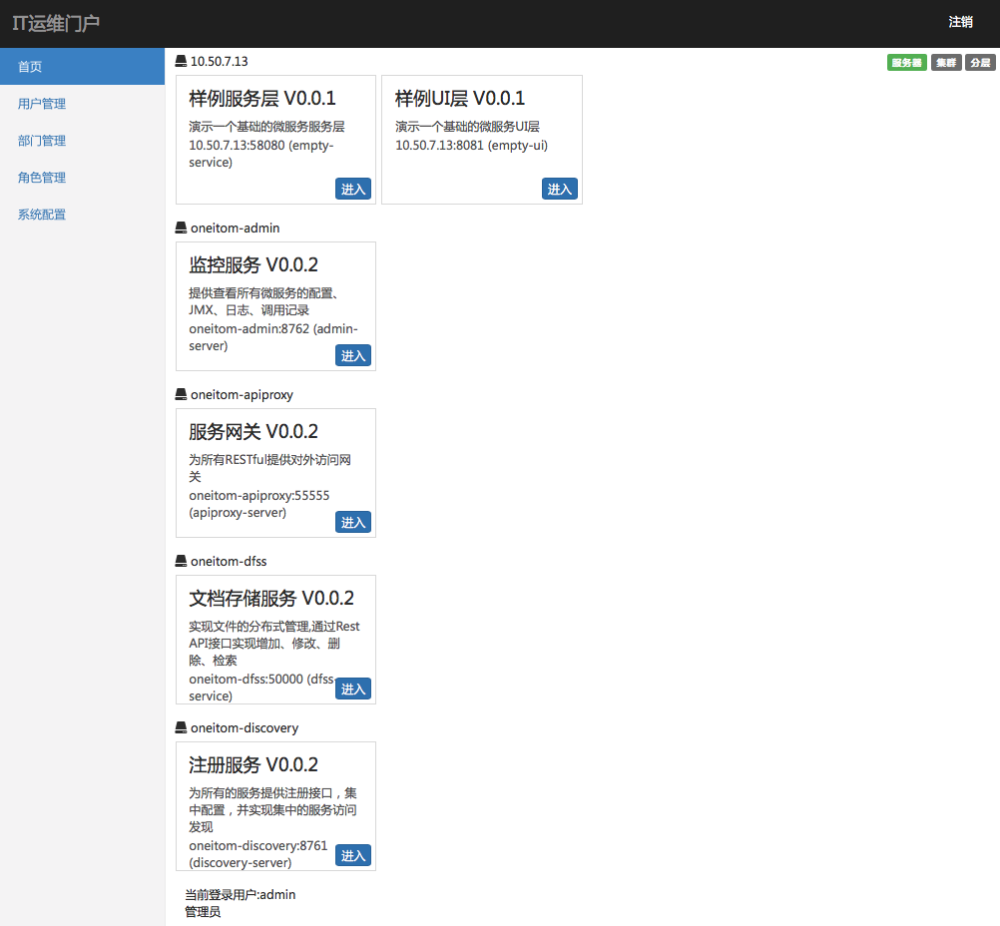

# 认证服务部署手册

> 作者 张磊

## 1. 准备

* JDK1.8+
* 已经安装了Oracle或者MySQL
* 已经启动了注册服务
* 已经安装了Redis
* 已经安装了共享MongoDB

## 2. 介质

| 文件名                     | 说明                       |
| -------------------------- | -------------------------- |
| auth-server-0.0.2.jar      | 主程序文件                 |
| run.sh                     | 启停脚本                   |
| static/images/login_bg.jpg | 登录页面背景图片（非必需） |

## 3. 启停

启动服务

```bash
sh run.sh start
```

停止服务

```bash
sh run.sh stop
```

 重启服务

```bash
sh run.sh restart
```

## 4. 参数

> 所有的参数都定义在启动脚本 run.sh 中 

| 参数名                                | 必填 | 默认值   | 说明                                                         |
| ------------------------------------- | ---- | -------- | ------------------------------------------------------------ |
| discovery.server.address              | 是   |          | 定义注册服务的地址，当集群模式时配置多个地址逗号分隔  discovery.server.address=https://192.168.0.1:8761/eureka/,https://192.168.0.2:8761/eureka/ |
| server.host                           | 是   |          | 服务绑定IP                                                   |
| server.port                           |      | 9999     | 服务绑定端口                                                 |
| spring.cloud.config.enable            | 是   | true     | 开启集中配置功能                                             |
| spring.cloud.config.profile           | 是   |          | 集中配置环境名，例如：生产环境                               |
| spring.datasource.platform            | 是   |          | 数据库平台类型配置，例如：mysql                              |
| spring.datasource.dataSourceClassName | 是   |          | 数据库JDBC驱动，例如：com.mysql.jdbc.Driver                  |
| spring.datasource.url                 | 是   |          | 数据库URL，例如：jdbc:mysql://oneitom-mysql:3306/authdb?useUnicode=true&characterEncoding=utf-8&autoReconnect=true |
| spring.datasource.username            | 是   |          | 数据库用户名                                                 |
| spring.datasource.password            | 是   |          | 数据库密码                                                   |
| authserver.tokenStoreType             | 是   | redis    | Token存储方式                                                |

### 4.1 Redis参数配置

> Redis连接方式分别为单例，哨兵，集群三种，生产环境不能使用单例方式，这三种方式的配置参数稍有不同，不能混合使用

*  单例模式参数

| 参数名                | 必填 | 默认值 | 说明        |
| --------------------- | ---- | ------ | ----------- |
| spring.redis.host     | 是   |        | redis地址   |
| spring.redis.port     | 是   |        | redis端口   |
| spring.redis.databas  | 是   | 0      | redis库序号 |
| spring.redis.password | 否   |        | redis密码   |

* 哨兵模式参数

| 参数名                       | 必填 | 默认值   | 说明                                                         |
| ---------------------------- | ---- | -------- | ------------------------------------------------------------ |
| spring.redis.port            | 是   |          | redis端口                                                    |
| spring.redis.databas         | 是   | 0        | redis库序号                                                  |
| spring.redis.sentinel.master | 是   | mymaster | （redis哨兵模式参数），master名称                            |
| spring.redis.sentinel.nodes  | 是   |          | （redis哨兵模式参数），node端口地址，例如：10.22.1.205:26379,10.22.1.204:26379 |

* 集群模式参数

| 参数名                             | 必填 | 默认值 | 说明              |
| ---------------------------------- | ---- | ------ | ----------------- |
| spring.redis.port                  | 是   |        | redis端口         |
| spring.redis.databas               | 是   | 0      | redis库序号       |
| spring.redis.cluster.enabled       | 是   | true   | 开启redis集群模式 |
| spring.redis.cluster.nodes         | 是   |        | Redis集群节点配置 |
| spring.redis.cluster.timeout       |      | 30     | 集群访问超时      |
| spring.redis.cluster.max-redirects |      | 8      |                   |

### 4.2 用户角色部门同步到MongoDB参数

| 参数名                  | 必填 | 默认值      | 说明                                                         |
| ----------------------- | ---- | ----------- | ------------------------------------------------------------ |
| spring.data.mongodb.uri | 是   |             | mongodb的连接地址，例如：mongodb://10.22.1.205/datashare     |
| spring.profiles.active  | 是   | syncmongodb | 增加syncmongodb到这个参数中，如果已经有其他参数，则逗号分隔，例如：spring.profiles.active=bomc,syncmongodb |

### 4.3 从BOMC同步用户部门角色到服务

| 参数名                                              | 必填 | 默认值 | 说明                                                         |
| --------------------------------------------------- | ---- | ------ | ------------------------------------------------------------ |
| spring.dynamicdatasource.enable                     | 是   | false  | 开启多数据源支持                                             |
| spring.dynamicdatasource.names=bomcbp               | 是   | bomcbp | 定义多数据源名称bomcbp                                       |
| spring.dynamicdatasource.bomcbp.dataSourceClassName | 是   |        | 定义数据源bomcbp的驱动名                                     |
| spring.dynamicdatasource.bomcbp.url                 | 是   |        | 定义数据源bomcbp的url                                        |
| spring.dynamicdatasource.bomcbp.username            | 是   |        | 定义数据源bomcbp的用户名                                     |
| spring.dynamicdatasource.bomcbp.password            | 是   |        | 定义数据源bomcbp的密码                                       |
| spring.profiles.active                              | 是   | bomc   | 增加bomc到这个参数中，如果已经有其他参数，则逗号分隔，例如：spring.profiles.active=bomc,syncmongodb |

## 5. 界面

进入登录页面，登录后进入认证服务首页

```shell
https://127.0.0.1:9999/auth
```

进入登录页面，登录后跳转到目标页面

```
 https://127.0.0.1:9999/auth?redirect_uri=http://ip:port/xxx
```



## 6. 插件安装
* 目录下新建plugins目录，放入插件jar包，如auth-server-plugin-xxxx.jar

* 修改启动脚本 run.sh 中 ,增加load.path

-Dloader.path="./plugins"
* 修改启动脚本 run.sh 中 ,增加插件启动参数，xxxx表示项目简写

| 参数名                                | 必填 | 默认值   | 说明                                                         |
| ------------------------------------ | ---- | -------- | ------------------------------------------------------------ |
| plugins.xxxx.4a.auth.url             | 是   |          | 定义插件的第三方认证地址,http://127.0.0.1:8080/sso  |
| plugins.xxxx.4a.synch.url            | 是   |          | 定义插件的第三方用户和组织同步地址 ,http://127.0.0.1/adminicenter                                        |
| plugins.xxxx.4a.enabled              |  是  |   false  | 启用插件参数                                               |


## 7. Docker

```yaml
version: '3.2'
services:
  oneitom-auth:
    image: boco/oneitom-auth:0.0.1
    hostname: oneitom-auth
    container_name: oneitom-auth
    restart: always
    networks:
      - oneitom-network
    ports:
      - '9999:9999'
    volumes:
      - ${ONEITOM_VOLUME_PATH}/oneitom-auth/logs:/auth-server/logs
    environment:
      - 'JAVA_OPTIONS=-Xmx512m -Xms512m'
      - 'discovery.server.address=https://oneitom-discovery:8761/eureka/'
      - 'server.host=oneitom-auth'
      - 'spring.datasource.platform=mysql'
      - 'spring.datasource.dataSourceClassName=com.mysql.jdbc.Driver'
      - 'spring.datasource.url=jdbc:mysql://oneitom-mysql:3306/authdb?useUnicode=true&characterEncoding=utf-8&autoReconnect=true'
      - 'spring.datasource.username=authdb-user'
      - 'spring.datasource.password=ENC(mBaGBXPu1VFgECoBH5NGWeTdFLy79Ic5)'
      - 'authserver.tokenStoreType=redis'
      - 'spring.redis.host=oneitom-redis'
      - 'spring.redis.port=6379'
      - 'custom.datasource.enable=false'
      - 'eureka.instance.metadataMap.iplatformtype=平台服务'
    labels:
     - oneitom-auth-cluster                

networks:
  oneitom-network:
    external: true
```


