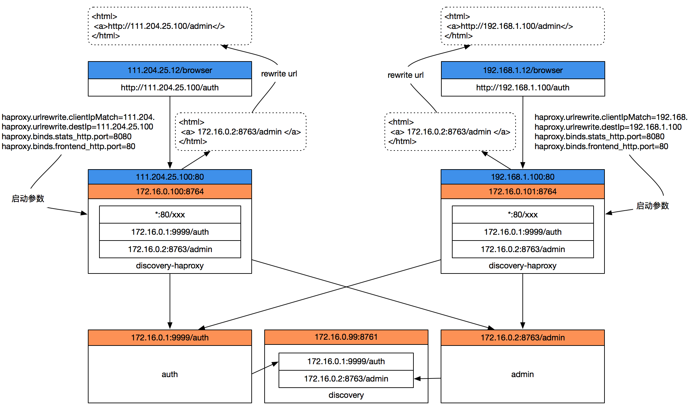

# 访问代理服务部署手册

> 作者 张磊
>
> 访问代理服务自动代理所有已注册服务，并提供统一的访问地址，同时提供页面URL地址重写功能，支持通过部署多个代理服务实现不同网络域的用户通过各自的代理进行服务访问



## 1. 准备

* JDK1.8+
* 服务器已经安装了HAProxy1.8+

## 2. 介质

| 文件名                          | 说明                                                         |
| ------------------------------- | ------------------------------------------------------------ |
| discovery-haproxy-1.0.0.100.jar | 主程序文件                                                   |
| run.sh                          | 启停脚本                                                     |
| reloadhaproxy.sh                | 重新加载HAProxy配置文件脚本，注意这个脚本中的HAProxy的命令路径是否和本机的HAProxy路径一致 |

## 3. 启停

启动服务

```bash
sh run.sh start
```

停止服务

```bash
sh run.sh stop
```

 重启服务

```bash
sh run.sh restart
```

##  4. 参数

> 所有的参数都定义在启动脚本 run.sh 中 

| 参数名                           | 必填 | 默认值 | 说明                                                         |
| -------------------------------- | ---- | ------ | ------------------------------------------------------------ |
| discovery.server.address         | 是   |        | 定义注册服务的地址，当集群模式时配置多个地址逗号分隔  discovery.server.address=https://192.168.0.1:8761/eureka/,https://192.168.0.2:8761/eureka/ |
| server.host                      | 是   |        | 服务绑定IP                                                   |
| server.port                      |      | 8764   | 服务绑定端口                                                 |
| spring.cloud.config.enabled      | 是   | true   | 开启集中配置功能                                             |
| spring.cloud.config.profile      | 是   |        | 集中配置环境名，例如：生产环境                               |
| haproxy.file                     | 是   |        | haproxy.cfg 的文件全路径                                     |
| haproxy.reload                   | 是   |        | reloadhaproxy.sh 文件全路径                                  |
| haproxy.urlrewrite.clientIpMatch | 是   |        | 访问客户端IP地址段，多个地址逗号分隔，例如：111.204<br />**注意：这个客户端IP地址片段是服务器端获取的客户端IP，经过代理后有可能无法获取真实的客户端IP** |
| haproxy.urlrewrite.destIp        | 是   |        | 外网访问的代理IP地址                                         |
| haproxy.binds.status_http.port   | 是   | 8080   | HAProxy状态页面访问端口                                      |
| haproxy.binds.frontend_http.port | 是   | 80     | 访问微服务的代理端口                                         |
| haproxy.bind.tcp.enabled         |      | false  | 是否开始四层访问代理（主要用于代理没有contextpath的服务）    |

## 5. 关于haproxy.urlrewrite.clientIpMatch

这个参数是用来匹配客户端IP地址，从而实现页面URL地址的重写。这个参数可以配置成多个IP地址段，逗号分隔，后台采用startWiths方式进行匹配，只有匹配的客户端地址才进行URL重写，因为存在通过代理访问的情况，所以这个地址不一定是客户端的真实地址（这取决于代理是否通过Head透传了客户端的真实IP），也可能存在客户端IP地址不固定的情况（多出现在通过广域网访问时），例如：


## 6. 界面

访问代理服务器状态页面

```shell
http://${haproxy.urlrewrite.destIp}:${aproxy.binds.status_http.port}/stats
```

访问被管认证服务

```shell
http://${haproxy.urlrewrite.destIp}:${haproxy.binds.frontend_http.port}/auth
```

## 7. 页面URL地址重写

> 通过代理访问页面时，可以使用Thymeleaf的ProxyURL.resolverURL标签实现URL地址重写为代理地址

原始页面写法

```html
<form th:action="${serviceInfo.homePageUrl}">
	<input type="hidden" name="access_token" th:value="${access_token}"></input>
	<button class="btn btn-xs btn-primary" type="submit">进入</button>
</form>
```

URL地址重写

```html
<form th:action="${#ProxyURL.resolverURL('__${serviceInfo.homePageUrl}__')}">
	<input type="hidden" name="access_token" th:value="${access_token}"></input>
	<button class="btn btn-xs btn-primary" type="submit">进入</button>
</form>
```

效果说明：

* 通过外网地址登录认证服务，然后看到认证服务内有一个admin服务的URL地址serviceInfo.homePageUrl 
* serviceInfo.homePageUrl 在后台配置的地址是 http://172.16.0.101:8764/admin
* 通过111.204.25.100地址打开auth页面中admin的地址变为 http://111.204.25.100/admin
* 通过192.168.1.100地址打开auth页面中admin的地址变为 http://192.168.1.100/admin
* 通过172.16.0.1地址打开auth页面中admin的地址变为 http://172.16.0.2:8763/admin

> 通过代理访问页面时，可以使用Thymeleaf的ProxyURL.resolverAddress标签实现IP:PORT地址重写为代理地址

用法同上，就是参数不同，这个方法接收IP和端口两个参数

例如(IPV4)：

```html
<span th:text="${#ProxyURL.resolverURL('172.16.0.101','8080')}">
```

返回 

```html
<span>111.204.25.100:8080</span>
```

例如(IPV6)：

```html
<span th:text="${#ProxyURL.resolverURL('FEDC:BA98:7654:3210:FEDC:BA98:7654:3210','8080')}">
```

返回 

```html
<span>[FEDC:BA98:7654:3210:FEDC:BA98:7654:3210]:8080</span>
```


## 8. Docker

```yaml
version: '3.2'
services:
  oneitom-discovery-haproxy:
    image: boco/oneitom-discovery-haproxy:1.0.0.100
    container_name: oneitom-discovery-haproxy
    restart: always
    network_mode: host
    environment:
      - 'JAVA_OPTIONS=-Xmx512m -Xms512m'
      - 'discovery.server.address=http://172.16.0.99:8761/eureka/'
      - 'eureka.instance.metadataMap.tenant=trident'
      - 'spring.cloud.config.busisys=trident'
      - 'spring.cloud.config.enabled=true'
      - 'spring.cloud.config.profile=生产'
      - 'server.host.prefix=10.22.'
      - 'haproxy.urlrewrite.destIp=111.204.25.100'
      - 'haproxy.urlrewrite.clientIpMatch=111.204.'
      - 'haproxy.binds.frontend_http.port=80'
      - 'haproxy.binds.stats_http.port=8080'
    volumes:
      - /opt/BOCO/oneitom/docker_volume/oneitom-discovery-haproxy:/usr/local/etc/haproxy:rw
      - /opt/BOCO/oneitom/docker_volume/oneitom-discovery-haproxy/logs:/discovery-haproxy/logs
    labels:
     - oneitom-discovery-haproxy-cluster
```

