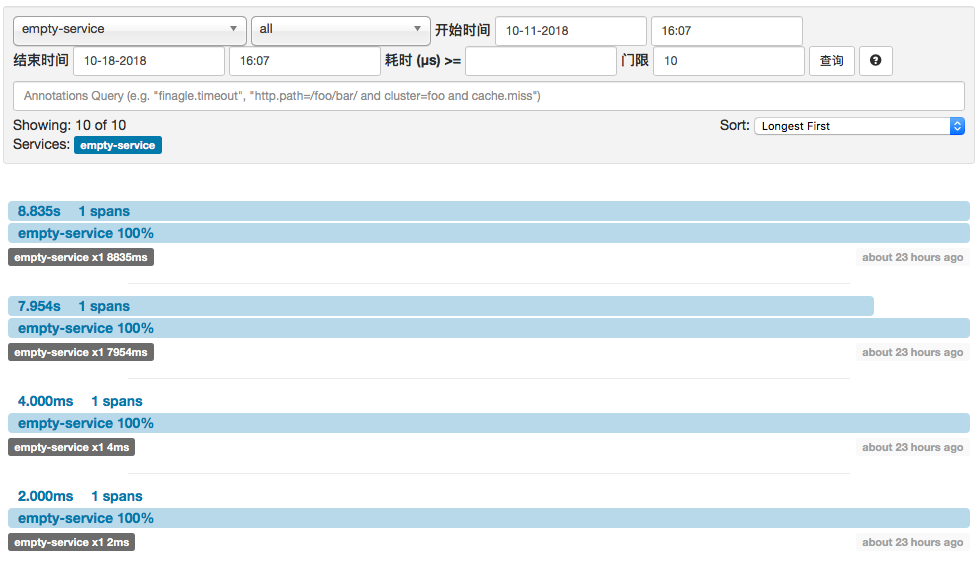
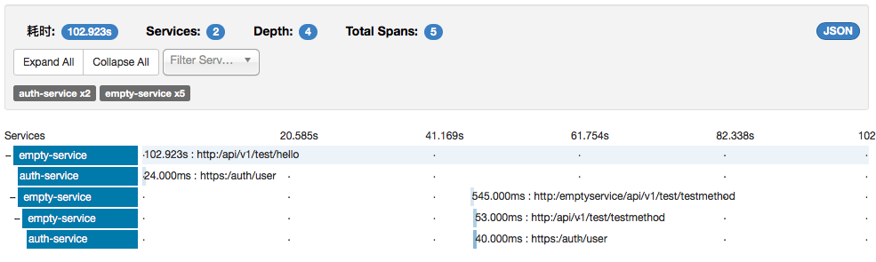
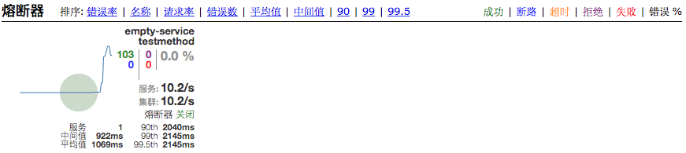
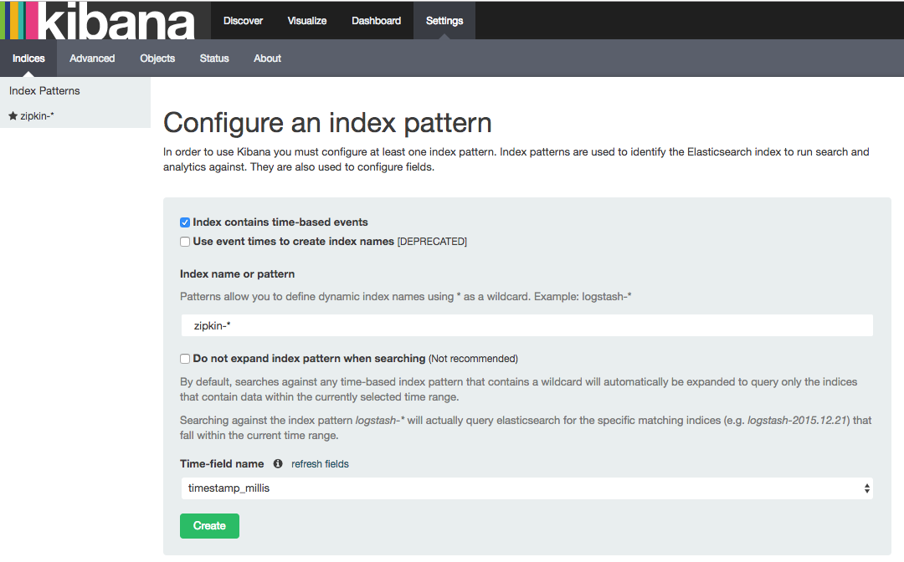
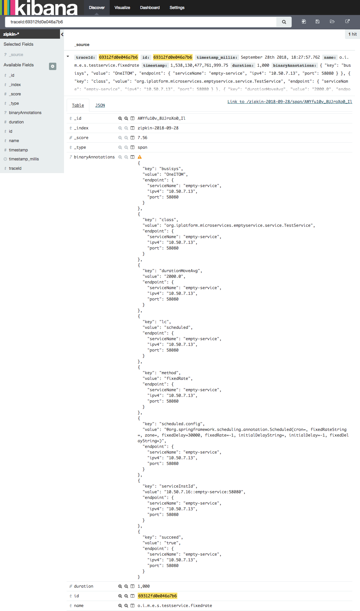

# 跟踪服务部署手册

> 作者 张磊
>
> 跟踪服务负责从集中配置的消息总线中接收调用链信息，并将调用链信息存储在ElasticSearch服务中

## 1. 准备

- JDK1.8+
- 已经安装了ElasticSearch
- 已经启动了注册服务

## 2. 介质

| 文件名                 | 说明       |
| ---------------------- | ---------- |
| trace-server-0.0.2.jar | 主程序文件 |
| run.sh                 | 启停脚本   |

## 3. 启停

启动服务

```bash
sh run.sh start
```

停止服务

```bash
sh run.sh stop
```

 重启服务

```bash
sh run.sh restart
```

## 4. 参数

> 所有的参数都定义在启动脚本 run.sh 中 

| 参数名                                      | 必填 | 默认值        | 说明                                                         |
| ------------------------------------------- | ---- | ------------- | ------------------------------------------------------------ |
| discovery.server.address                    | 是   |               | 定义注册服务的地址，当集群模式时配置多个地址逗号分隔  discovery.server.address=https://192.168.0.1:8761/eureka/,https://192.168.0.2:8761/eureka/ |
| server.host                                 | 是   |               | 服务绑定IP                                                   |
| server.port                                 |      | 8763          | 服务绑定端口                                                 |
| spring.cloud.config.enable                  | 是   | true          | 开启集中配置功能                                             |
| spring.cloud.config.profile                 | 是   |               | 集中配置环境名，例如：生产环境                               |
| zipkin.storage.type                         | 是   | elasticsearch | 存储方式配置                                                 |
| zipkin.storage.elasticsearch.cluster        | 是   |               | ES集群名称，例如：elasticsearch                              |
| zipkin.storage.elasticsearch.hosts          | 是   |               | ES集群地址，例如：oneitom-elk:9300                           |
| zipkin.storage.elasticsearch.index          |      | zipkin        | 设置索引名称前缀，格式，zipkin-yyyy-MM-dd                    |
| zipkin.storage.elasticsearch.index-shards   |      | 1             | 设置默认索引分片个数，默认为1片                              |
| zipkin.storage.elasticsearch.index-replicas |      | 1             | 设置默认索引副本个数，默认为1个副本                          |

## 5. 界面

```
https://127.0.0.1:8763
```

跟踪服务列表



调用链详细信息



熔断器监控



## 6. Kibana

> 可以通过Kibana查看ES中存储的调用链

```http
http://127.0.0.1:5601
```

> 在Settings中增加ES索引 zipkin-*




> 在Discover中可以查询到ES中的调用链



## 7. 跟踪服务集成

> 其他微服务产品如果要集成跟踪服务请参考[服务跟踪配置手册](../developer/trace/README.md)

## 8. Docker

```yaml
version: '3.2'
services:   
  oneitom-trace:
    image: boco/oneitom-trace:0.0.2
    hostname: oneitom-trace
    container_name: oneitom-trace
    restart: always
    networks:
      - oneitom-network
    ports:
      - '8763:8763'
    volumes:
      - ${ONEITOM_VOLUME_PATH}/oneitom-trace/logs:/trace-server/logs      
    environment:
      - 'JAVA_OPTIONS=-Xmx512m -Xms512m'
      - 'discovery.server.address=https://oneitom-discovery:8761/eureka/'
      - 'server.host=oneitom-trace'
      - 'spring.cloud.config.enabled=true'
      - 'spring.cloud.config.profile=测试'
      - 'spring.zipkin.type=activemq'
      - 'zipkin.storage.type=elasticsearch'
      - 'zipkin.storage.elasticsearch.cluster=elasticsearch'
      - 'zipkin.storage.elasticsearch.hosts=oneitom-elk:9300'
      - 'zipkin.storage.elasticsearch.max-requests=64'
      - 'zipkin.storage.elasticsearch.index=zipkin'
      - 'zipkin.storage.elasticsearch.index-shards=1'
      - 'zipkin.storage.elasticsearch.index-replicas=1'      
      - 'eureka.instance.metadataMap.iplatformtype=平台服务'
    labels:
     - oneitom-trace-cluster                   

networks:
  oneitom-network:
    external: true
```

